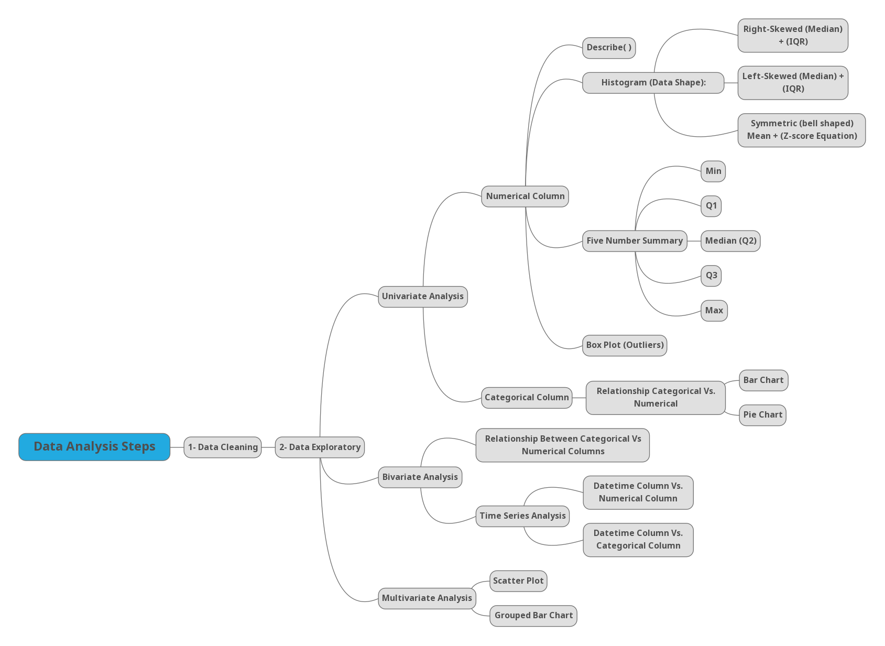

# 1. Introduction:
In this project, we would use SQL using the Microsft SQL Server DBMS to export specific dataset from the main database (International Sales Database) using SQL queries, then we would use Python using Jupyter Notebook to analyze the exported dataset through cleaning it, then describe statistical characteristics (Mean - Median - IQR - Min - Max), dealing with outliers using (Pandas Library), and finally visualize the data using different python libraries such as (Matplotlib - Seaborn - Plotly), to show different trends and patterns from between the data.

You can see all SQL queries for the project here: [SQL_Queries folder](/SQL_Queries/), and Python Jupyter Notebooks here:[Python_Analysis](Python_Analysis).

# 2. Tools I Used:
To thoroughly explore the data analyst job market, I utilized the capabilities of a range of essential tools:
1. **SQL:** allowing me to query the database and explore critical insights.
2. **Microsoft SQL Server:** database management system.
3. **Python:** as it a powerhouse in data analysis, thanks to its simplicity, flexibility, and the vast array of libraries it offers.
4. **Visual Studio Code:** for database management and executing SQL queries, and for Python coding for analysis.
5. **Jupyter Notebook:** It is an interactive web-based environment that allows users to create and share documents containing live code, visualizations, and narrative text, using Python language.
6. **Git & GitHub:** for sharing my SQL scripts and analysis.

# 3. SQL Queries Analysis (Microsoft SQL Server & VS Code):

### **3.1. Create Datebase:**
- Create a Database (InternationalCompanySalesData) to Upload Data from the Excel Sheet on it,
by Using (SQL Server Import and Export Wizard) to Import Data Into Database.
- Make Sure That All Columns in All Tables Have The Suitable Data Type.
- Before Finish Import Data Into Database.

```sql
USE MASTER;
GO

CREATE DATABASE InternationalCompanySalesData;
```
### **3.2. Extract Full Join Data Set:**
- Extract Full Join Data from tables (Customer - Order - Product - Supplier) into one table to analyze it using Python.
```sql
USE InternationalCompanySalesData;
GO

SELECT 
    C.*, O.*, P.*, S.*
FROM
    Customer AS C
    FULL JOIN [Order] AS O ON C.Id = O.CustomerId
    FULL JOIN OrderItem AS OI ON O.Id = OI.OrderId
    FULL JOIN Product AS P ON OI.ProductId = P.Id
    FULL JOIN Supplier AS S ON P.SupplierId = S.Id;
```
# 4. Python Analysis (VS Code & Jupyter Notebook):
- First, we would export the result from the last SQL query into a CSV file, then read it in VS Code using the Python pandas library to import it as a dataframe to start analysis on it.
- Second, we would inspect the dataframe to find all dataframe problems to clean and fix it.
- Third, we would start the Data Exploratory step, through Univariate, Bivariate, and Multivariate analysis, using suitable plots and charts to discover different patterns and trends between data.
- We can summarize the steps of the analysis using Python into this chart:



### **4.1. Data Cleaning Step:**  
- In this step, we should check our dataframe column's data type, check the columns' name, and nan- values, and check the numerical and categorical columns to fix any problems before analysis.   
- After we checked the dataframe, we found these issues.

**Issues**:

**1- Delete Rows With Nan OrderId Values:**
```python
df_copy = df_copy[df_copy["OrderId"].notna()]
```
**2. Change the Data Type of the OrderDate Column from Object (String) to Datetime Data Type:**
```python
df_copy["OrderDate"] = pd.to_datetime(df_copy["OrderDate"])
```
**3. Change the Data Type of Columns (CustomerId - OrderId - OrderNumber - ProductId - SuplierId) from Float to Integer Data Type:**
```python
change_columns = ["CustomerId", "OrderId", "OrderNumber", "ProductId", "SupplierId"]
for column in list(df_copy.columns):
    if column in change_columns:
        df_copy[column] = df_copy[column].astype(int)
```
**4. Rename Columns (City.1 - Country.1 - Phone.1) as They Similar to Previous Columns:**
```python
df_copy.rename(columns={
    "City.1":"SupplierCity",
    "Country.1":"SupplierCountry",
    "Phone.1":"SupplierPhone"
}, inplace=True)
```

- Then, we would create a function collecting all data cleaning steps in one function to save time in the next analysis steps 

**5- Create Function Wrang (Data Wrangling) With Optional Variables (None):**
```python
def wrang(
    dataframe,
    encoding = None,
    dropnanvalues = None,
    duplicatevlues = None,
    datecolumn = None,
    renamedcolumns = None  
):
    # Loading Data From CSV File:
    df = pd.read_csv(dataframe, encoding= encoding)

    # Drop Nan Value Of Specific Columns:
    df.dropna(subset=dropnanvalues, inplace=True)

    # Remove Duplicates From Specific Columns:
    df.drop_duplicates(subset=duplicatevlues, inplace=True)

    # Convert Date Column From Object to Datetime:
    df[datecolumn] = pd.to_datetime(df[datecolumn])

    # Rename Columns Names:
    df.rename(columns= renamedcolumns, inplace=True)

    # Stripe and Lowercase Columns Names:
    df.columns = df.columns.str.strip().str.lower()
    return(df)    
```
**6- Create New Dataframe (Orders) By Using Wrang User-Defined Function to use this Dataframe as Main Dataframe In all Next Steps:**
```python
orders = wrang(dataframe="Full_Join_Data.csv",
               encoding="latin-1",
               dropnanvalues=["OrderId"],
               duplicatevlues="OrderId",
               datecolumn="OrderDate",
               renamedcolumns={"City.1":"SupplierCity", "Country.1":"SupplierCountry", "Phone.1":"SupplierPhone"})
```
**7- Then We Would Convert columns ["customerid", "orderid", "ordernumber", "productid", "supplierid"], to Integer Data Type:**
```python
columns_edit = ["customerid", "orderid", "ordernumber", "productid", "supplierid"]
for column in list(orders.columns):
    if column in columns_edit:
        orders[column] = orders[column].astype(int)
```